# TrafficExchange - Neon.Today

A complete Traffic Exchange platform featuring a React-based frontend and a Node.js-based backend, utilizing a microservices-inspired architecture with PostgreSQL and Redis.

## 🚀 Features

- **User Authentication**: Secure Login & Signup with JWT.
- **Campaign Management**: Easy creation, management, and tracking of marketing campaigns.
- **Website Pledging/Listing**: List websites for traffic exchange.
- **Real-Time Analytics & Earnings**: Comprehensive stats on user earnings and traffic insights.
- **Configurable Settings**: Fine-grained user and system settings.
- **Containerized**: Fully deployable via Docker and Docker Compose.

## 🛠 Tech Stack

- **Frontend**: Next.js, Tailwind CSS, Framer Motion, DaisyUI, Recharts.
- **Backend**: NestJS, TypeORM, Passport, JWT.
- **Database**: PostgreSQL (Persistent Data).
- **Cache/Queue**: Redis (Rate limiting, caching).
- **Reverse Proxy**: Nginx.

## 📦 Project Structure

- `/frontend` - Next.js UI application.
- `/backend` - NestJS REST API.
- `/nginx` - Nginx configuration and routing.
- `/Screenshots` - Selected visual screenshots of the application views.
- `docker-compose.yml` - Container orchestration for development/production.

## 🚀 Getting Started

Ensure you have Docker and Docker Compose installed on your system.

```bash
# Build and start all services via Docker Compose
docker-compose up --build -d
```

Once running:
- **Frontend** will be available at: `http://localhost` (Nginx mapping port 80 to 3001 internally if customized)
- **Backend API** will be accessible at: `http://localhost/api`

## 📸 Screenshots

### 1. Homepage & Landing Pages
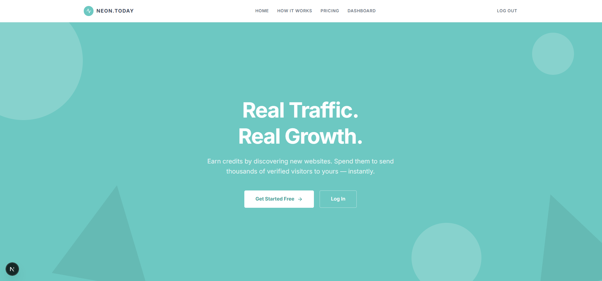

### 2. Main Dashboard Layout
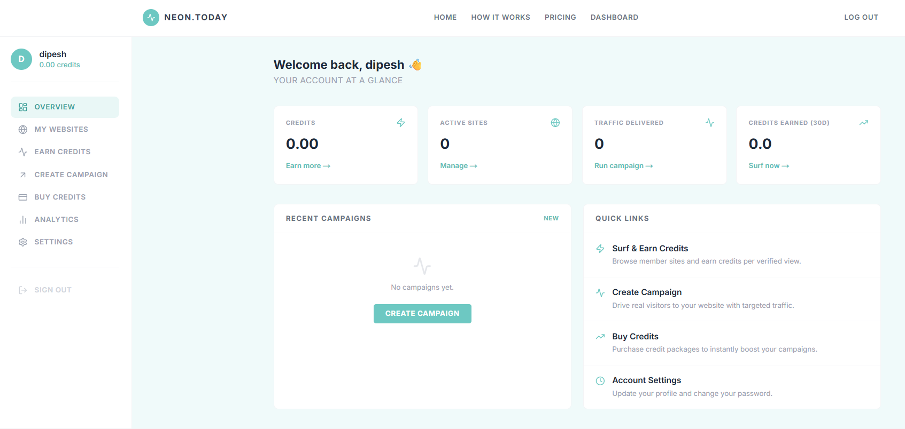

### 3. Authentication Flow
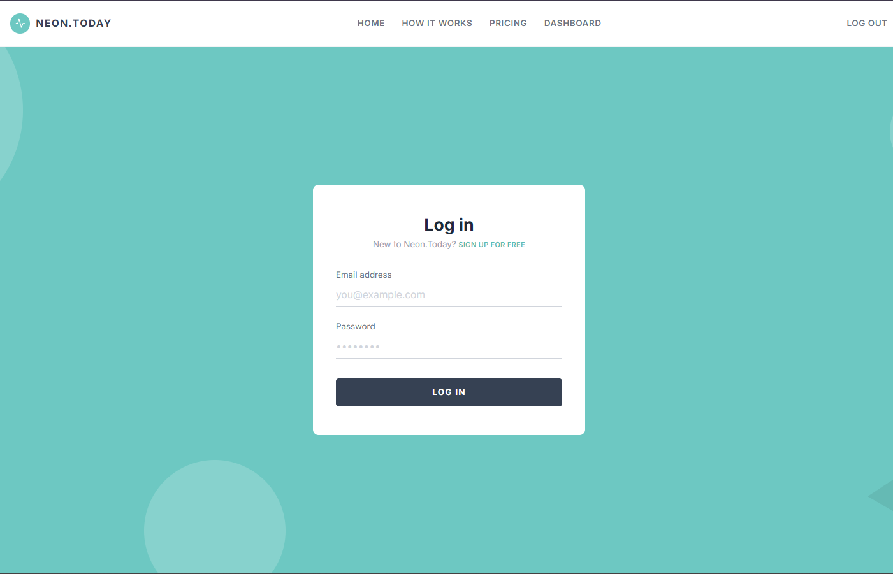
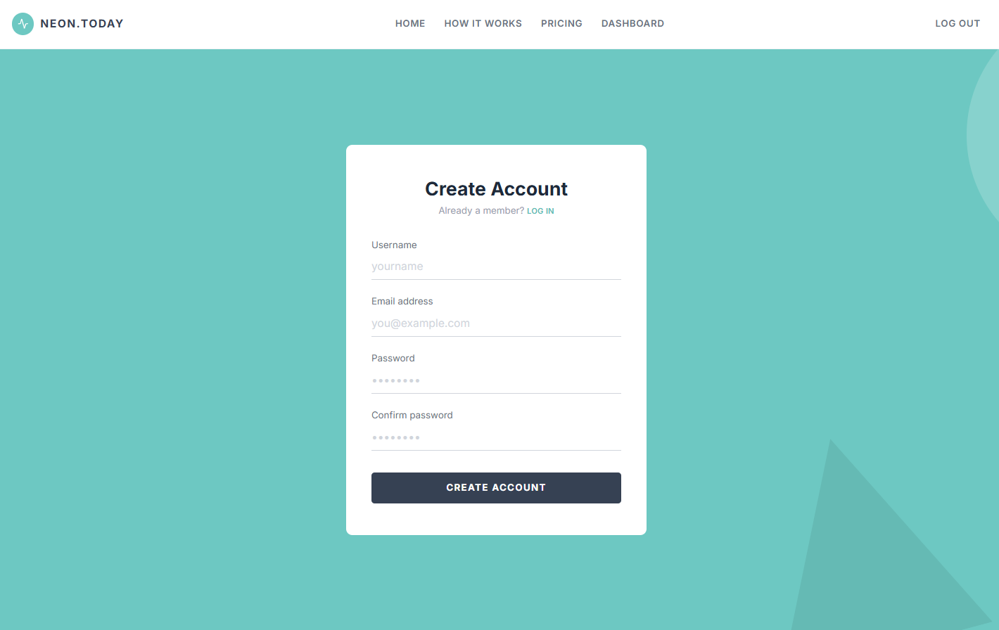

### 4. Campaigns & Earning
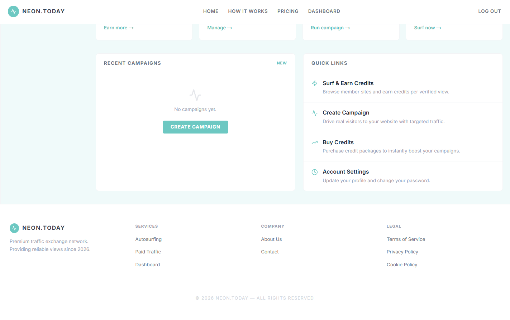
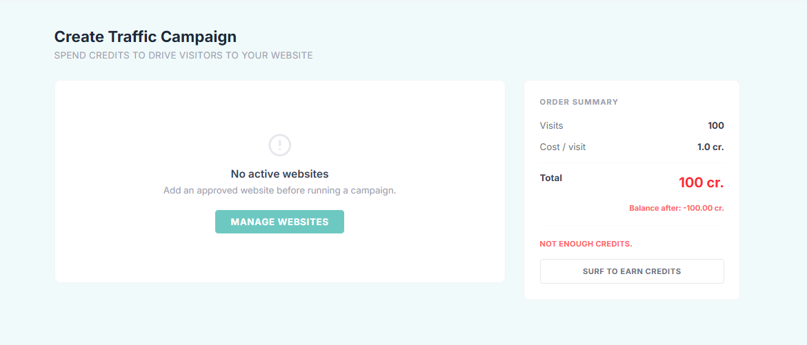
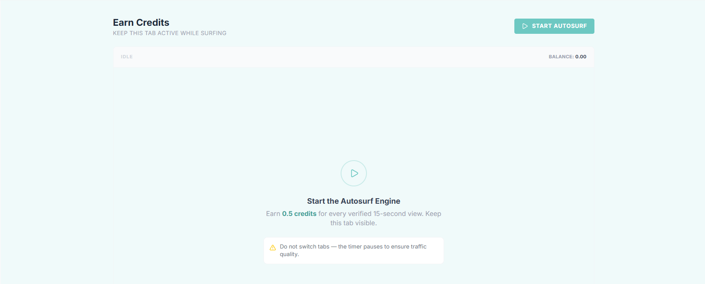

### 5. Management & Analytics
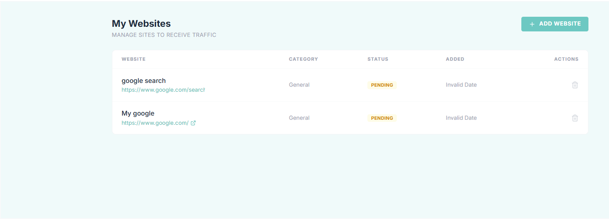
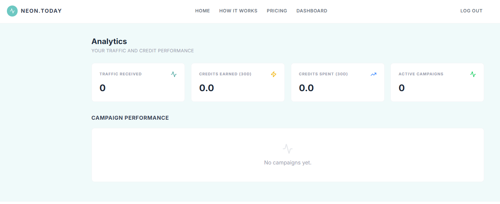

### 6. Settings & DevOps
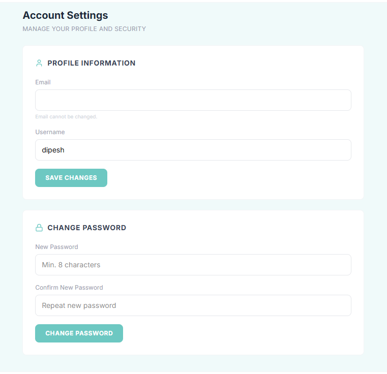
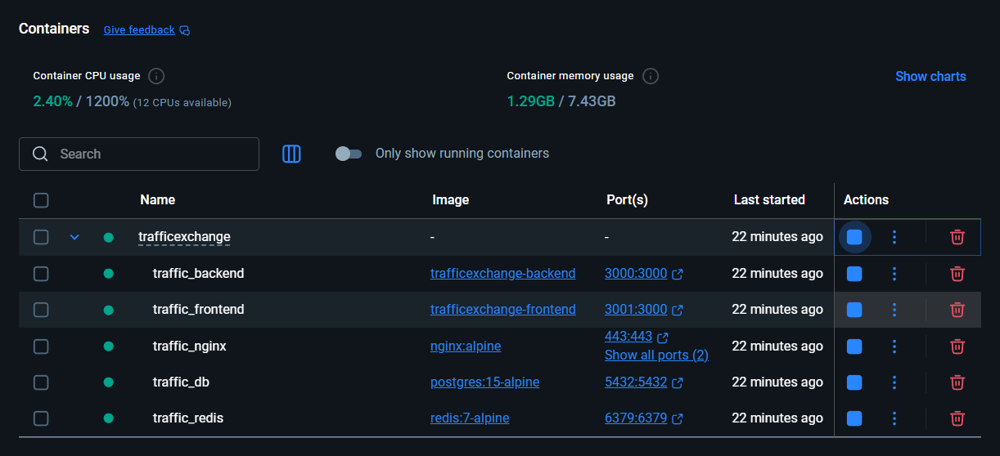
